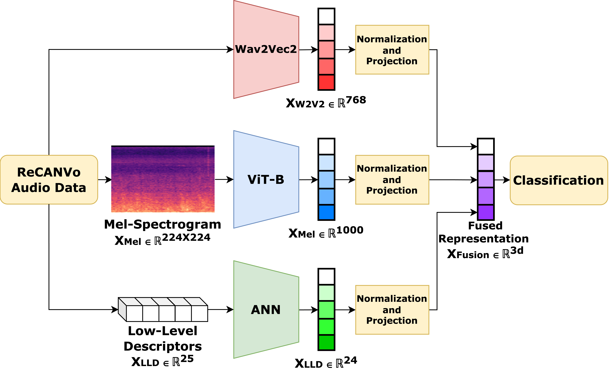

<h1 font-size:40px align="center">Multi-Feature Audio Fusion for Nonverbal Vocalization Classification</h2>
<h3 font-size:40px align="center">Siddhant Bikram Shah and Kristina T. Johnson</h3>

<p align="center">
  
</p>

This is the code repository for our paper **<a href="https://ieeexplore.ieee.org/abstract/document/10889317">Multi-Feature Audio Fusion for Nonverbal Vocalization Classification**</a> published at ICASSP 2025. 

## Code

All experimental changes can be made through a single file: configs.py. 

## Dataset

The open-access **<a href="https://www.nature.com/articles/s41597-023-02405-7">ReCANVo dataset**</a> was used for this paper. The dataset can be downloaded from **<a href="https://zenodo.org/records/5786860">this link**</a>.

## Citation

```
@inproceedings{shah2025multi,
  title={Multi-Feature Audio Fusion for Nonverbal Vocalization Classification},
  author={Shah, Siddhant Bikram and Johnson, Kristina T},
  booktitle={ICASSP 2025-2025 IEEE International Conference on Acoustics, Speech and Signal Processing (ICASSP)},
  pages={1--5},
  year={2025},
  organization={IEEE}
}
```

OR

S. B. Shah and K. T. Johnson, "Multi-Feature Audio Fusion for Nonverbal Vocalization Classification," ICASSP 2025 - 2025 IEEE International Conference on Acoustics, Speech and Signal Processing (ICASSP), Hyderabad, India, 2025, pp. 1-5, doi: 10.1109/ICASSP49660.2025.10889317.
